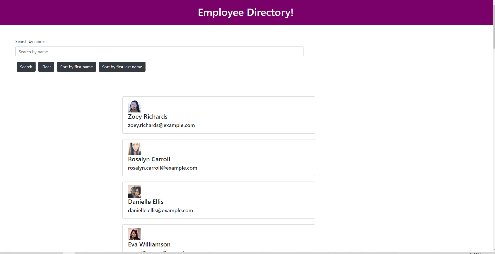

## Table of Contents

- Link
- Description
- Questions

## Would you like to see this application in action??

Follow the link below to try out the application for yourself! Let the gains begin!

[Link](https://salty-brushlands-40352.herokuapp.com/)

## Description of Employee-Tracker

With this application, using react I was able to build an employee directory. The user is able to seach an employee by first or last name, or sort all employees by first or last name. The employee list is loaded when the page first renders, showing the user the first and last name, email address, as well as a picture of the employee. Check out the link above!

## Questions?

If you have any questions or concerns, please feel free to reach out to me with the contact information provided below. Any suggestions are greatly appriciated!

- [josephguajardo@ymail.com](josephguajardo@ymail.com)

- [jagg1991](jagg1991).

